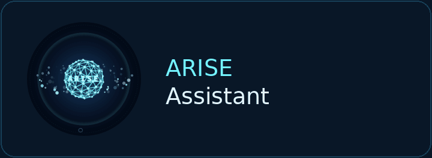
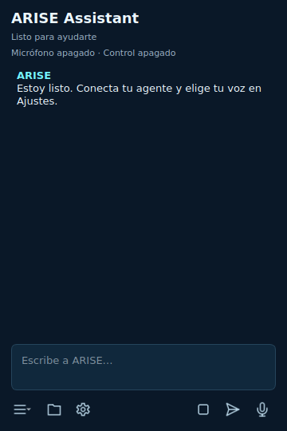

# ARISE Assistant



Un orbe para conversar y trabajar con tu agente en Windows. Identidad ARISE, panel compacto, voz configurable y un proceso residente independiente de la interfaz. Gentle Shell sobre Pi ejecuta las tareas; la interfaz muestra lo que haces, los resultados y las decisiones que requieren tu intervención.



> Implementación inicial en `feature/native-orb-daemon`. Las imágenes se capturaron de los widgets Qt reales en Linux, no de una maqueta web. La validación de micrófono, transparencia, monitores y control de un PC Windows requiere pruebas en ese equipo. Consulta [VALIDATION.md](docs/VALIDATION.md).

## Qué incluye

- Orbe circular de 96 px, arrastrable y configurable entre 48 y 240 px.
- Animación de 24 fotogramas de la esfera ARISE original: atlas PNG de aproximadamente 580 KB, 10 FPS, movimiento reducido y alternativa QPainter.
- Panel de 360 × 540 px: ARISE Assistant arriba, conversación ampliada y barra inferior de iconos. Enter envía; Shift+Enter añade una línea.
- Daemon independiente; cerrar el panel no cancela el trabajo. Supervisor de procesos escrito en Rust.
- Detección de Pi, paquetes Gentle Shell instalados y rutas de configuración existentes.
- Shell invisible por chat con Pi y Gentle Shell; carpetas chat/chat-0001, chat-0002 y sesiones reanudables con --continue.
- Proyectos elegidos por carpeta: primer chat en la ruta original; siguientes chats en worktrees Git o copias independientes, con ajustes del agente por chat.
- Conexión mediante RPC de Pi: sesiones, modelos disponibles, esfuerzo, eventos y diálogos de extensiones.
- Voz OpenAI Realtime y Gemini Live con adaptadores independientes, audio nativo y delegación a Gentle Shell.
- Conversación local por turnos: Vosk, faster-whisper o OpenAI Whisper → Pi → voces Windows SAPI o Piper. Detección de modelos existentes; los archivos .pt y las carpetas CTranslate2 usan motores separados.
- Vosk español incluido en el instalador y ZIP de modelos separado. Activación local configurable, micrófono, clic y Ctrl+Alt+A.
- Ctrl+Alt+Esc para cancelar tareas y revocar el control.
- MCP stdio, importación de configuraciones, catálogo real y contenido de imagen preservado para modelos con visión.
- Gmail OAuth Desktop con PKCE y DPAPI: buscar, leer, crear borradores con adjuntos y solicitar envío con revisión visible.
- Archivos dentro del workspace y notas explícitas de Memory; las extensiones de memoria existentes de Pi siguen cargándose.
- Modo de código opcional para habilitar las herramientas de shell y edición de Pi.
- Acceso web por texto opcional, con sesión privada, control de origen, CSRF y despliegue detrás de HTTPS.
- Docker, CI de Windows, empaquetado portable y receta de instalador Inno Setup.

## Instalar y configurar

[Descargar ARISE 0.3.0 para Windows](https://github.com/Maicololiveras/Arise/actions/runs/37954993176/artifacts/11628570722). Descomprime el artefacto y ejecuta `dist/ARISE-Setup.exe`. Incluye la versión portable y resultados de las pruebas.

El build base incluye Pi 1.1.0, Gentle Shell/Gentle AI 4.0.0, Vosk español y los motores Whisper CPU. Los cuatro repos de MCP son privados: para incluirlos desde GitHub Actions configura el secret `ARISE_COMPONENTS_TOKEN` con lectura de esos repos; sin él, se construye el paquete base y puedes detectar/importar las herramientas ya instaladas. La conexión GitHub de ChatGPT no entrega automáticamente su permiso a Actions.

El workflow de Windows genera `dist/ARISE` y, si Inno Setup está disponible, `ARISE-Setup.exe`. El paquete compila la aplicación e incluye Pi/Gentle Shell; con `-WithTools` añade ScreenView, InputControl, Forge y Transcripción. No requiere instalar Python ni Node en la máquina que recibe el paquete.

1. Instala ARISE y abre **Configurar ARISE**.
2. En **Agente**, detecta Pi/Gentle Shell o selecciona las rutas. Si ya tienes proveedores o suscripciones autenticados en Pi, conserva su configuración. Usa **Abrir Pi para /login** para autenticar una cuenta compatible y **Conectar y listar modelos** para elegir el modelo disponible.
3. En **Voz y audio**, elige proveedor, modelo, voz, micrófono y altavoz. En **Credenciales**, guarda la clave del proveedor o úsala únicamente durante esa ejecución.
4. Prueba la conversación. La suscripción del agente y la API de voz son conexiones distintas; elegir un proveedor en la interfaz no concede acceso a sus modelos.
5. Para voz local no necesitas clave de voz: elige **local**, motor **auto** o **vosk**. El modelo español viene incluido. **Detectar mis modelos de voz** permite elegir tus .pt o carpetas faster-whisper. Para activar por voz, ajusta la frase y marca la escucha local. Desactivada, el micrófono permanece cerrado en reposo.
6. Para Gmail, selecciona un JSON OAuth de Google de tipo Desktop con la API Gmail habilitada y conecta tu cuenta. La distribución pública de ese conector puede requerir verificación por Google.

En la barra inferior, el icono de carpeta añade un proyecto; el menú hamburguesa permite elegir proyecto/chat y crear un **Nuevo chat**. El engranaje abre Ajustes; el micrófono inicia o termina la conversación de voz. El selector muestra solo los chats de ese proyecto. Cambiar de chat cancela el trabajo activo, guarda sesión e historial, y cierra sus procesos. Al volver, el launcher invisible `gentle-shell.mjs` reanuda la sesión exacta con `--continue --session`, dentro de su ruta. No se mantienen shells inactivas consumiendo recursos. El cierre usa abort RPC y cierre de pipes, el equivalente funcional a cancelar y salir sin simular teclas en una terminal.

El menú **Comandos de la sesión** obtiene `get_commands` del motor activo. Los comandos escritos con `/` se ejecutan como comandos, y uno desconocido se rechaza sin enviarlo al modelo. Gentle 4.0.0 tiene soporte RPC nativo para sus preguntas; ARISE adapta además perfiles, modelos, paleta, estadísticas, uso, agentes, cambios e historial a controles nativos. La copia se genera en caché y conserva los handlers del paquete original. **/gentle:customize** abre los ajustes de ARISE; los comandos que configuran el aspecto de la TUI conservan ese alcance. Consulta [GENTLE-COMMANDS.md](docs/GENTLE-COMMANDS.md).

Los perfiles de Gentle son globales y pueden fijarse a un clon/repositorio; no cambian de alcance por estar en ARISE. Las sesiones y los ajustes del agente son por chat. Las credenciales y la voz pertenecen al daemon.

El paquete guarda los chats bajo la carpeta `chat` junto al ejecutable; en desarrollo usa la carpeta de datos. Los worktrees conservan su rama y sus archivos al cerrar el chat. Git worktrees copian los cambios no confirmados y archivos no ignorados del proyecto; los archivos ignorados por Git, como node_modules, se regeneran en la nueva ruta si se necesitan.

El programa inicia el daemon automáticamente. Sus menús distinguen **Cerrar panel y orbe** de **Salir de ARISE**, que detiene el motor. La activación y los atajos residen en el daemon. El orbe aparece al abrir la vista; si la vista está cerrada, el daemon puede seguir recibiendo voz y ejecutando tareas.

Para ejecutar desde código en Windows:

```powershell
.\Install-Dev.ps1
.\Start-ARISE.cmd
```

Para compilar:

```powershell
.\scripts\Build-Windows.ps1 -WithTools -ReposRoot C:\Repos -GentlePath C:\Repos\gentle-shell-enterprise
```

`ReposRoot` debe contener `screenview-mcp`, `inputcontrol-mcp`, `transcripcion-ia` y `forge-mcp`. Sin `GentlePath`, el build usa `gentle-pi@4.0.0`; con esa opción puedes empaquetar tu fork. Las credenciales no se incluyen en los paquetes.

Compilar el componente nativo de Gentle AI en Windows requiere Go 1.25.10 o posterior en el equipo de build. El instalador de Gentle verifica la versión y el checksum del código publicado. El usuario que instala ARISE recibe el binario compilado y no necesita Go.

## Pruebas

```bash
npm ci --prefix vendor --ignore-scripts
python -m pip install .
QT_QPA_PLATFORM=offscreen python scripts/test.py
cargo test --locked --manifest-path host/Cargo.toml
```

Dentro de Docker:

```bash
docker compose run --build --rm tests
```

La suite utiliza Pi real con un proveedor HTTP local simulado, servidores WebSocket de prueba, procesos MCP de prueba, daemon separado y widgets Qt reales. No utiliza cuentas ni envía correos. El build Windows valida el host y ejecutable congelados, carga el Vosk integrado, importa ambos motores Whisper y comprueba las voces SAPI. Con acceso a los repos privados hace además `initialize` y `tools/list` de esos MCP, sin ejecutar acciones de escritorio.

El entorno de desarrollo original no ofrece Docker y bloquea los namespaces necesarios para un Docker sin privilegios. Por eso el resultado local y el resultado de CI Docker se documentan por separado. Un contenedor Linux no demuestra que funcionen el micrófono o el escritorio de Windows.

## Acceso privado desde navegador / VPS

Consulta [REMOTE.md](docs/REMOTE.md). El gateway ofrece conversación por texto y decisiones; no captura el micrófono del navegador. Un VPS Linux ejecuta herramientas del servidor. Para controlar tu Windows, ejecuta el daemon en ese Windows y conecta mediante una red privada o un proxy TLS. No publiques directamente el puente interno del agente.

## Arquitectura e identidad

[Arquitectura](docs/ARCHITECTURE.md) · [Identidad](assets/identity.json) · [Validación](docs/VALIDATION.md) · [Checklist Windows](docs/WINDOWS-CHECK.md).

Renderer y fuente del orbe reutilizados de [praxisgenai-harness](https://github.com/Maicololiveras/praxisgenai-harness/blob/main/docs/ARISE-ORB.md). JetBrains Mono conserva su licencia OFL. Pi, Gentle Shell y los MCP conservan sus respectivas licencias.
