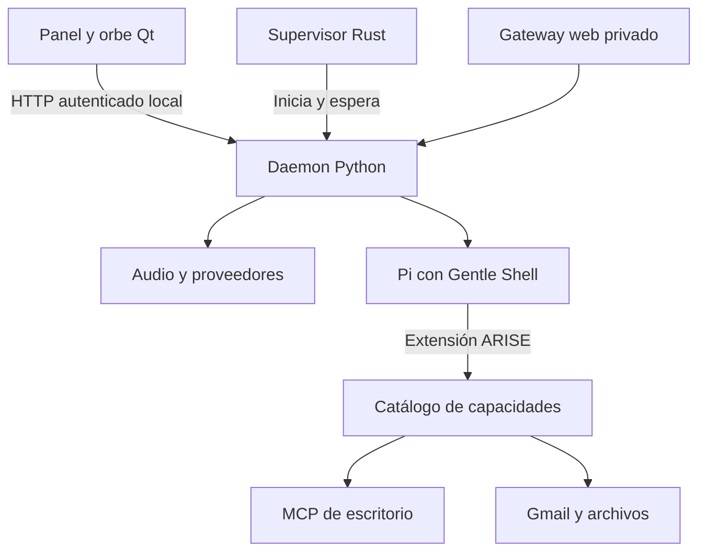

# ARISE runtime

La esfera conserva la identidad ARISE del renderer QPainter de praxisgenai-harness. El atlas contiene 24 imágenes generadas de ese renderer; no usa WebGL. Panel y ajustes son widgets Qt.

`arise-host` es un supervisor pequeño de procesos, no un segundo motor de agentes. El engine Python posee el lock de instancia, audio, almacenamiento, tareas y el puente autenticado. El cliente Qt no mantiene herramientas ni claves. El motor Pi posee el bucle de ejecución y carga las extensiones de Gentle Shell.

En desarrollo el launcher inicia el daemon Python directamente. El paquete compilado incorpora el host Rust. Ambos recorridos usan los mismos argumentos y lock. Cerrar el renderer no cierra el daemon. Salir detiene voz, revoca control y aborta Pi. Reiniciar no repite tareas externas: las tareas que estaban ejecutándose quedan interrumpidas y deben verificarse.

El descriptor del daemon contiene una capacidad local; Windows la protege con DPAPI. En Linux el descriptor solo tiene permisos 0600. Esos permisos no sustituyen aislamiento ante código que ya se ejecuta como el mismo usuario.

OpenAI Realtime y Gemini Live tienen protocolos diferentes. Se confirma la configuración del proveedor antes de enviar audio. Los llamados de voz delegan a la sesión Pi; no exponen todos los MCP al modelo de voz. La transcripción local utiliza Whisper y salida SAPI/Piper por turnos. El detector Vosk recibe audio únicamente cuando se habilita activación local.

Las acciones de escritorio de InputControl/Forge se serializan. El control está deshabilitado hasta que el usuario lo permite desde la interfaz. Detener revoca ese permiso antes de esperar el aborto. Los resultados externos son datos, no nuevas instrucciones. Gmail registra cada intento de envío antes de solicitarlo al proveedor y no repite automáticamente un envío incierto.

Las credenciales se guardan en DPAPI o durante la sesión en memoria. Pi conserva sus mecanismos de /login y proveedores configurados por el usuario. El modo Work bloquea shell y edición de Pi; Code permite sus herramientas cuando se habilita explícitamente en ajustes.

El puente interno rechaza Origin de navegadores y exige token por petición. El gateway opcional tiene su propia contraseña y cookies; no entrega al navegador el token interno ni las claves de los proveedores.

## Proyectos y shells

SQLite indexa proyectos y chats. Cada carpeta chat contiene session.json, preferences.json, messages.json y session/ con el historial JSONL original de Pi. Solo el chat seleccionado mantiene un proceso RPC. Al suspenderlo se aborta la tarea, se verifica el archivo de sesión, se guarda el modelo actual y se cierran Pi y los MCP. El cliente renderiza exclusivamente eventos del chat elegido; la extensión etiqueta sus solicitudes con el ID del chat para rechazar llamadas de una sesión antigua.

Los nuevos chats usan git worktree con una rama arise/chat-ID. Sin Git se crea una copia. No se borra ni se fusiona un worktree al cerrar un chat. El launcher de Gentle importa Pi en el mismo proceso Node; no añade procesos hijos huérfanos. --continue se combina con el archivo explícito del chat, para no retomar accidentalmente otra conversación.

Gentle 4.0.0 usa RPC nativo para preguntas cuando GENTLE_SHELL_INTERACTIVE_HOST=1. ARISE adapta sus paneles TUI de perfiles, modelos, comandos, uso, agentes, estadísticas, cambios e historial a select/input/editor/notify, conservando los handlers originales. El visor de agentes filtra thinking y no expone razonamiento privado. Se mantiene compatibilidad con los paneles de perfiles/modelos de 3.3.0. La copia generada en caché resuelve módulos y recursos desde la instalación original. Los forks o versiones distintas conservan su código sin transformación.
